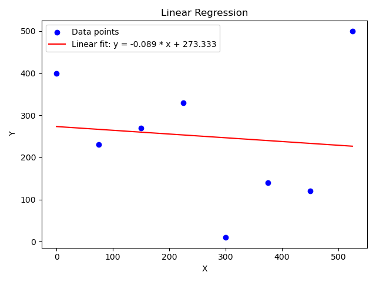
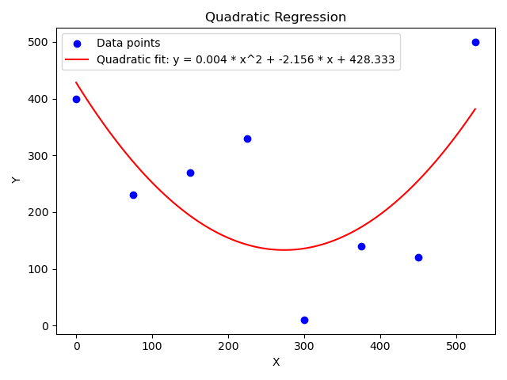
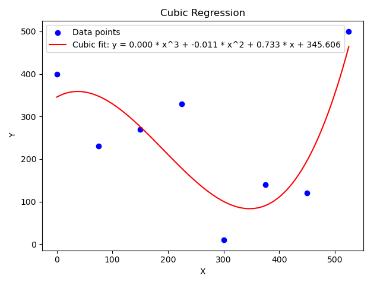

# Statistics and plotting using `python`


## Table of Contents
- [Statistics and plotting using `python`](#statistics-and-plotting-using-python)
  - [Table of Contents](#table-of-contents)
  - [Dependencies](#dependencies)
  - [`I/O`](#io)
  - [How to run?](#how-to-run)
  - [Calculations behind](#calculations-behind)
    - [Approximations](#approximations)
    - [Average](#average)
    - [Deviation from everage](#deviation-from-everage)
    - [Standard average deviation:](#standard-average-deviation)
    - [Trust interval](#trust-interval)
    - [Linear Regression](#linear-regression)
    - [Quadratic Regression](#quadratic-regression)
    - [Cubic Regression](#cubic-regression)
  - [Bibliography (Used Resources):](#bibliography-used-resources)


## Dependencies

```sh
$ pip3 install matplotlib numpy
$ pip3 list 
```


## `I/O`
---

The `input` of the `python` program is receive from a two-column `CSV` file.


> `CSV` = Comma Separated Values

The `input` `CSV` file must contain exactly two columns and a header line (column names).
The first column of this file will be seen as `X` values, and the second one, `Y` values.


Example:
```csv
X, Y 
5.10, 10
5.20, 90
5.90, 250
6.20, 450
```


The `output` data will be written in another `CSV` file and,
in a short time, several images will be generated and saved locally,
along with an **interactive plot** containing the following **subplots**:
- A bar chart
- A 2D Histogram
- Scattered Points
- Linear Reggression (line and scattered points)
- Quadratic Reggression (line and scattered points)
- Cubic Reggression (line and scattered points)

> Notice that the **interactive plot** will take control
> of the terminal.
> > no matter if the program is launched in background (`python3 main.py &`)
>
> It's a good practice to close the figure manually,
> since `CTRL C` will not work in terminal.


Thus, the `I/O` of this `python` project consists of multiple files,
defined in the code below `import` statement.

```python 3
import os
import sys
import csv
import math
import matplotlib.pyplot as plt     # for plotting and graphical support
import numpy as np                  # for linear regression
from typing import List, Tuple      # for data types

# I/O file paths
# feel free to customize them :)
PATH_INPUT_CSV = 'CSVs/in.csv'
PATH_OUTPUT_CSV = 'CSVs/out.csv'
PATH_CHART_BARS_PLOT = 'images/fig1.png'
PATH_HISTOGRAM_PLOT = 'images/fig2.png'
PATH_SCATTER_PLOT = 'images/fig3.png'
PATH_LIN_REGGR_PLOT = 'images/fig2.png'
PATH_QUAD_REGGR_PLOT = 'images/fig3.png'
PATH_CUBIC_REGGR_PLOT = 'images/fig4.png'
PATH_ALL_PLOTS = 'images/fig7.png'
```


The `output` `CSV` file will contain the following information:
- Statistics interpretations of `X` (the first column of `input` `CSV`):
    - Average
    - Deviation from average
    - Standard average deviation
    - Trust interval
  
- Approximation of `Y` in function of `X`:
    - Linear reggression
    - Quadratic regression
    - Cubic reggression


> Notice that the `output` `CSV` will have the same values for columns like
> averages and equations (think at it as **merged `Excel` column cells**)


## How to run?
---
First, create `CSV` file with exactly two columns:
the first one will be the input, and the second one - the ouput.

> Do not forget to include the **heder** (suggestive column names).


Then, run the following command in terminal and let the program do its calculations:

```sh
$ python3 main.py
```


## Calculations behind
---

You can take a look at the following [PDF file](statistica_fizica.pdf)


### Approximations

Notice that each value is upper rounded at the second decimal:

```python 3
def approx(num: float) -> float:
    return round(num, 2)


print(approx(5.400))    # 5.40
print(approx(5.404))    # 5.40
print(approx(5.405))    # 5.41
print(approx(5.406))    # 5,41


print(approx(8.094))    # 8.09
print(approx(8.095))    # 8.10

print(approx(10.990))   # 10.99
print(approx(10.999))   # 11.00

```


Aslo, in order to display a variable with exactly **two decimals**, we use `:.2f`,
with **three decimals**, `:.3f`, and so on.


```python 3
import math

print(f"{math.pi:.2}")      # 3.1
print(f"{math.pi:.3}")      # 3.14
```


### Average
---

Is a single value, produced by this formula:

```
X_avg = sum(x(i)) / n
```


### Deviation from everage
---


```
D(i) = X(I) - X_avg
```


### Standard average deviation:
---

> I am not fully sure that is formula is used corect,
> since I've seen multiple variant in class and on the Internet.


```
Sigma_X = sqrt(sum(X(i) - X_avg) / N * (N - 1))
```


### Trust interval
---

> I am not fully sure that is formula is used corect,
> since I've seen multiple variant in class and on the Internet.


### Linear Regression
---

<!-- splitting the screen with a vertical line -->
<div style="display: flex; justify-content: space-between; align-items: flex-start;">
  <div style="flex: 1; padding-right: 10px;">
    <!-- Text on the left side -->
    d: Y = a * X + b
    <br>
    Minimum mean square estimation
  </div>
  <div style="flex: 1;">
    <!-- Image on the right side -->
    
  </div>
</div>

### Quadratic Regression
---

<!-- splitting the screen with a vertical line -->
<div style="display: flex; justify-content: space-between; align-items: flex-start;">
  <div style="flex: 1; padding-right: 10px;">
    <!-- Text on the left side -->
    d: Y = a * X^2 + b * X + c
    <br>
    Minimum mean square estimation
  </div>
  <div style="flex: 1;">
    <!-- Image on the right side -->
    
  </div>
</div>

### Cubic Regression
---

<!-- splitting the screen with a vertical line -->
<div style="display: flex; justify-content: space-between; align-items: flex-start;">
  <div style="flex: 1; padding-right: 10px;">
    <!-- Text on the left side -->
    d: Y = a * X^3 + b * X^2 + c * X + d
    <br>
    Minimum mean square estimation
  </div>
  <div style="flex: 1;">
    <!-- Image on the right side -->
    
  </div>
</div>


## Bibliography (Used Resources):
---

- CSV - 25559 - Dataset - Catalog - Data.gov: <https://catalog.data.gov/dataset/?res_format=CSV>


- CSV files for download: <https://www.stats.govt.nz/large-datasets/csv-files-for-download/>


- Polynomial Reggression Online Calculator: <https://stats.blue/Stats_Suite/polynomial_regression_calculator.html> 


- Polynomial Linear Regression in Simple Words: <https://medium.com/@tavishi.1402/polynomial-linear-regression-in-machine-learning-in-simple-words-b39ea30aadbc>

- How to Perform Simple Linear Regression in Python (Step-by-Step): <https://www.statology.org/simple-linear-regression-in-python/>

- How to Perform Quadratic Regression in Python: <https://www.statology.org/quadratic-regression-python/>

- How to Perform Cubic Regression in Python: <https://www.statology.org/cubic-regression-python/>

- How to Perform Polynomial Regression in Python: <https://www.statology.org/polynomial-regression-python/>

- Pandas - Plotting: <https://www.w3schools.com/python/pandas/pandas_plotting.asp>

- Graph Plotting in Python | Set 1: <https://www.geeksforgeeks.org/graph-plotting-in-python-set-1/>
